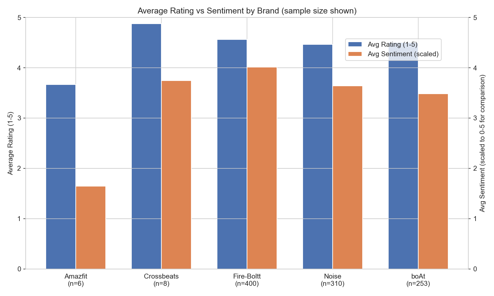
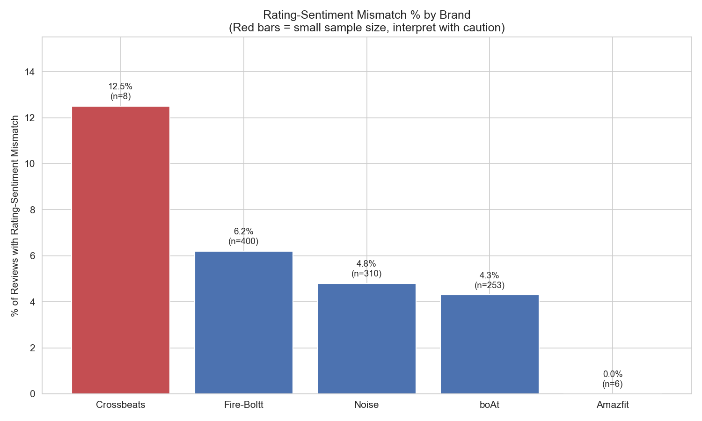
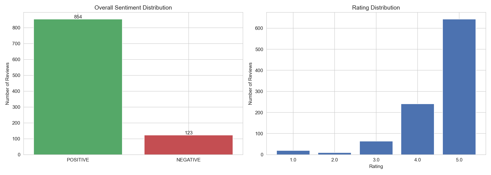

# 📊 Smartwatch Review Intelligence Dashboard

An end-to-end data pipeline and interactive dashboard that scrapes, stores, analyzes, and visualizes customer reviews for competing smartwatch brands sold on Flipkart — surfacing cases where the star rating a customer gives doesn't match the actual sentiment of their written review.

**🔗 Live demo:** [review-intelligence-dashboard-7vqjkz4ehecgz9zfcwsiuw.streamlit.app](https://review-intelligence-dashboard-7vqjkz4ehecgz9zfcwsiuw.streamlit.app)

---

## 🧩 Problem

Star ratings on e-commerce platforms are a noisy signal — a customer might leave 5 stars out of habit while describing a real problem in the text ("nice product but battery backup is very poor"). This project quantifies that noise: it scrapes real reviews, runs them through a sentiment model, and flags **rating–sentiment mismatches** so brands (or shoppers) can see past the star rating to what customers are actually saying.

## ✨ Features

- **Web scraping** — Selenium + BeautifulSoup pipeline that collects reviews across 8 competing smartwatch products from Flipkart (boAt, Noise, Fire-Boltt, Amazfit, Crossbeats)
- **Relational storage** — PostgreSQL schema (`raw_reviews` + `processed_reviews`, linked via foreign key) hosted on Supabase
- **Sentiment analysis** — Pretrained DistilBERT (`distilbert-base-uncased-finetuned-sst-2-english`) classifies each review as POSITIVE/NEGATIVE
- **Mismatch detection** — Flags reviews where the star rating and model sentiment disagree (e.g. 5★ + NEGATIVE sentiment)
- **Interactive dashboard** — Streamlit app with brand/product filters, comparison charts, a mismatch table, and free-text keyword search across all reviews

## 🛠️ Tech Stack

| Layer | Tools |
|---|---|
| Scraping | Selenium, BeautifulSoup |
| Database | PostgreSQL (Supabase) |
| NLP | HuggingFace Transformers (DistilBERT) |
| Analysis | Pandas, SQLAlchemy |
| Dashboard | Streamlit, Plotly |
| Deployment | Streamlit Community Cloud |

## 📈 Key Insight

Across 977 reviews spanning 5 brands, **Amazfit** showed a rating–sentiment mismatch rate roughly double that of every other brand in the dataset — meaning a disproportionate share of its high-star reviews contained negative language, a pattern invisible from the star rating alone.
## Sample Charts







## 🗂️ Project Structure

```
├── app.py                                  # Streamlit dashboard
├── 01_scraping_test.ipynb                  # Scraping, DB load, sentiment analysis, EDA
├── requirements.txt                        # Python dependencies
├── flipkart_reviews_raw.csv                # Raw scraped reviews
├── flipkart_reviews_with_sentiment.csv     # Reviews with sentiment scores
├── brand_rating_vs_sentiment.png           # EDA chart
├── mismatch_by_brand.png                   # EDA chart
├── overall_distributions.png               # EDA chart
```

## 🚀 Running Locally

```bash
git clone https://github.com/rishiraj2323/review-intelligence-dashboard.git
cd review-intelligence-dashboard
pip install -r requirements.txt

# set your database password as an environment variable
set DB_PASSWORD=your_password_here   # Windows
# export DB_PASSWORD=your_password_here   # macOS/Linux

streamlit run app.py
```

## 📌 Notes

- Database is hosted on Supabase (PostgreSQL) — credentials are read from an environment variable, never hardcoded.
- Sentiment scores from DistilBERT represent model *confidence*, not polarity direction — the dashboard uses `sentiment_label` (POSITIVE/NEGATIVE) for brand comparisons rather than the raw confidence score, to avoid a misleading average.

---

**Author:** Rishi Raj
